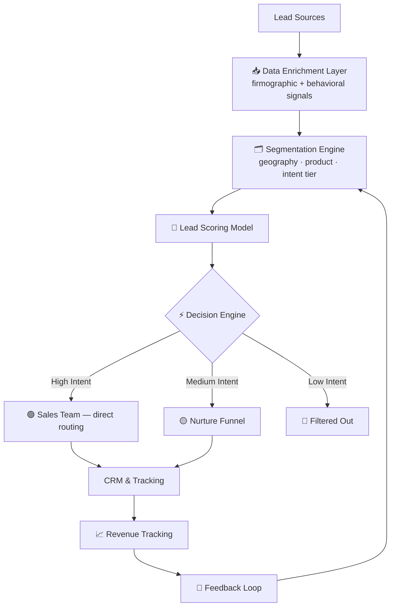

# 💰 Sales & Revenue AI Automation System

**An AI-driven lead qualification and revenue system that scaled a 4-person pilot into a $15M+ annual PPL engine — built and led at Gartner Digital Markets.**

  

---

## 🧭 Overview

Gartner Digital Markets' India prospecting operation started as a self-funded experiment: four interns manually qualifying leads for the software review platform's catalogue. I architected and led the AI-driven revenue system that scaled that experiment into a dedicated team generating **USD 15M+ in annual PPL revenue** and **USD 2M+ in PPC revenue** — without proportional headcount growth.

The system's core insight: stop optimising for lead volume. Optimise for **revenue per lead** by combining firmographic enrichment, behavioral signals, and intelligent routing to get high-intent leads to the right sales rep at the right time.

---

## ⚡ Impact

| Metric | Result |
|---|---|
| PPL revenue generated | **USD 15M+ annually** |
| PPC revenue | **USD 2M+ annually** |
| Cost Per Lead reduction | **25%** across Asian and European markets |
| New vendors onboarded monthly | **~2,500** |
| Territory coverage expansion | **10–15%** |

---

## 🧩 Problem

- High volumes of unqualified leads wasting sales capacity
- Manual qualification creating bottlenecks and SLA misses
- No intelligence layer connecting lead signals to conversion likelihood
- Fragmented targeting — same outreach for vastly different lead quality
- Revenue growth constrained by headcount, not market size

---

## 🧠 Solution

Designed an **AI-driven revenue system** combining:

- 📊 **Lead enrichment** — firmographic + behavioral signals per lead
- 🗂️ **Segmentation engine** — geography, product category, intent tier
- 🎯 **Lead scoring model** — conversion likelihood ranking
- ⚡ **Decision engine** — intelligent routing by intent level
- 🔄 **Feedback loop** — revenue data continuously improving the model

👉 Goal: **Maximise revenue per lead, not just lead volume**

---

## 🏗️ System Architecture

---

## 🙋 My Role

I conceived, architected, and led the build of this system — from the original 4-intern pilot to the full production revenue engine. I defined the lead scoring logic, the segmentation approach, and the routing criteria, and partnered with engineering to ship it into production.

---

## 🔗 Related

This revenue system is part of a unified AI architecture across Trust & Safety and Revenue operations.
👉 [Full case study: AI Revenue Case Study](https://github.com/vickybansal99-tech/ai-revenue-case-study)

---

*⚠️ Enterprise-grade systems built within global marketplace operations. Specific tooling and data sources are generalised due to confidentiality.*
